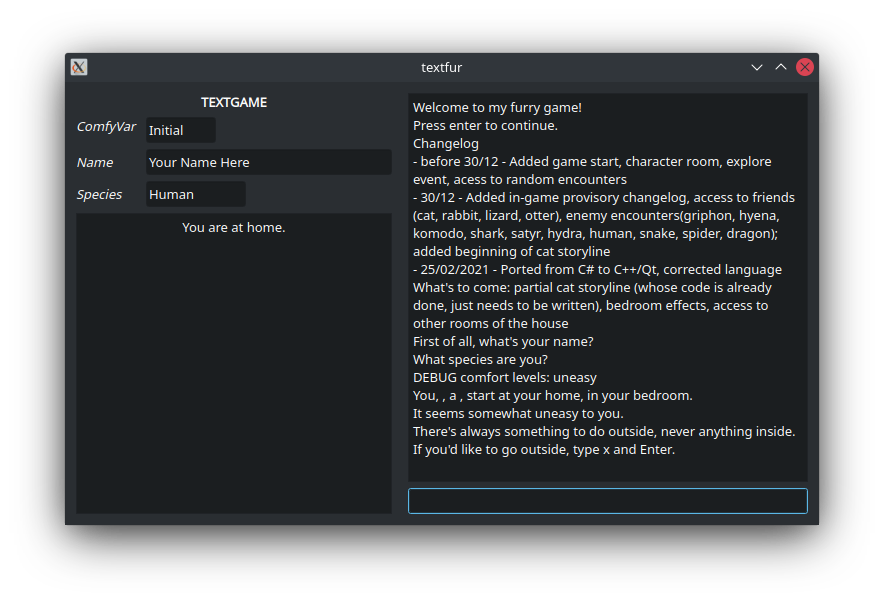

# textfur

TextFur is a textgame that was originally written in Mono C# in 2017 and recently ported to C++/Qt in 2021.

This game has served as a means for me to learn how to code, especially with respect to C++/Qt.

